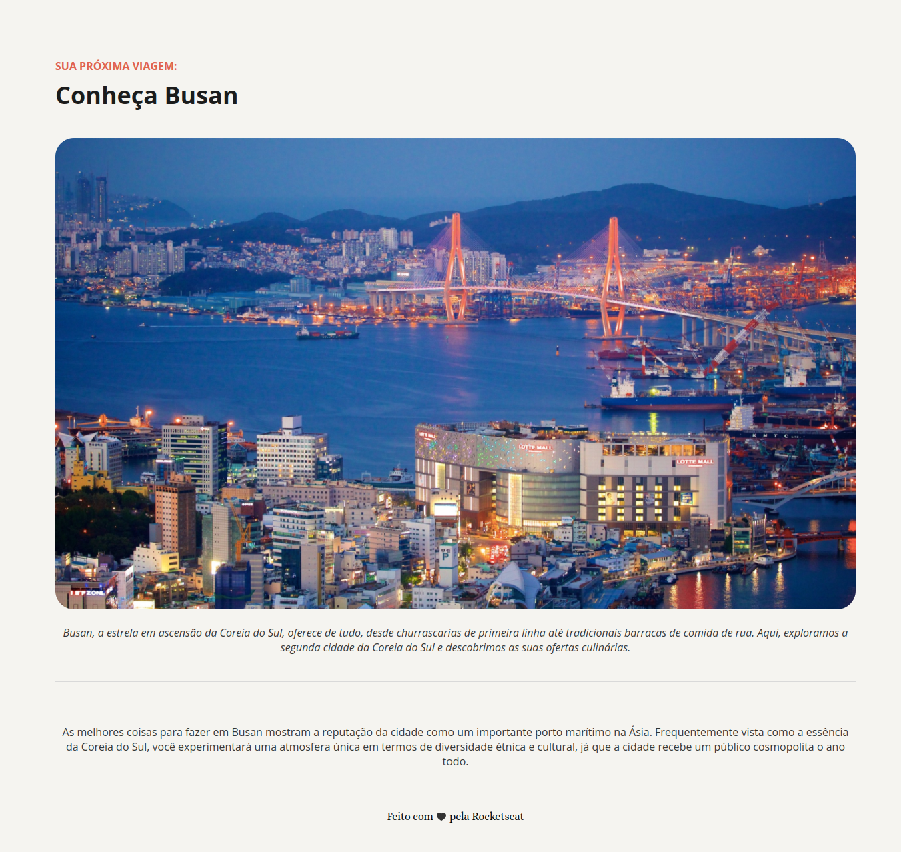

# 🌏 Local Turístico: Conheça Busan

> Projeto desenvolvido durante a **formação FullStack da Rocketseat**, sob mentoria do **professor Mayk Brito**.
> Desafio prático da trilha **HTML e CSS**.

---

## 🧭 Sobre o projeto

Uma página simples e elegante de turismo, criada para apresentar **três destinos imperdíveis em Busan**, Coreia do Sul 🇰🇷.
O foco do desafio foi aplicar fundamentos sólidos de **HTML semântico** e **CSS básico**, sem o uso de frameworks ou recursos modernos como Flexbox e Grid.

---

## 🛠️ Tecnologias utilizadas

* **HTML5**
* **CSS**
* **GitHub**

---

## 🚀 Aprendizados

Esse projeto reforçou boas práticas de estruturação de páginas, semântica, estilização e versionamento de código.
Além disso, foi uma oportunidade de revisar conceitos base que sustentam qualquer stack moderna de front-end.

Feito com 💜 durante o curso da [Rocketseat](https://www.rocketseat.com.br)
👨‍🏫 Mentoria: [Mayk Brito](https://github.com/maykbrito)
🪩 Entre na [comunidade Rocketseat](https://discord.gg/rocketseat)

 
